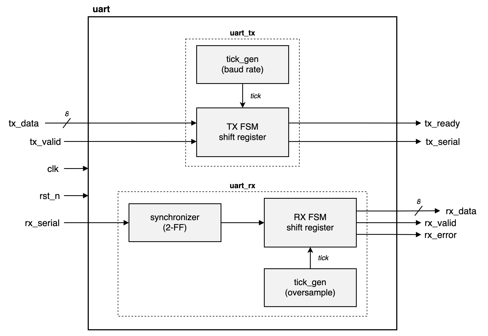
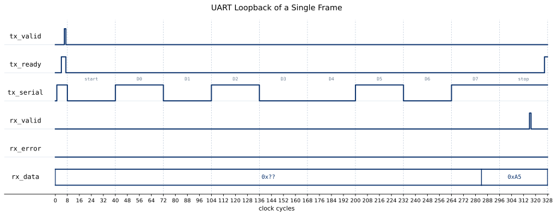

# uart

[](https://github.com/drewbabel/uart/actions/workflows/ci.yml)

A configurable UART core written in SystemVerilog.

 The core transmits and receives 8N1 serial data, with the transmitter serializing a parallel byte behind start and stop bits, and the receiver oversampling the incoming line to recover each byte and flag framing errors. 
 
 A tick generator divides the system clock down to the baud rate and the receiver's oversample rate, and a two-flop synchronizer guards the asynchronous receive input against metastability. 
 
 Every module has a self-checking testbench, the transmitter and receiver each carry a SymbiYosys formal proof, and the whole core is verified in loopback both in simulation and on a Basys 3 FPGA.



## Interface

| Signal | Direction | Width | Description |
|--------|-----------|-------|-------------|
| `clk` | in | 1 | System clock |
| `rst_n` | in | 1 | Synchronous active-low reset |
| `tx_data` | in | `DATA_BITS` | Byte to transmit |
| `tx_valid` | in | 1 | Assert when `tx_ready` is high to start transmission |
| `tx_ready` | out | 1 | Transmitter ready for next byte |
| `tx_serial` | out | 1 | UART transmit line (idle high) |
| `rx_serial` | in | 1 | UART receive line (idle high) |
| `rx_data` | out | `DATA_BITS` | Received byte |
| `rx_valid` | out | 1 | One-cycle pulse on valid receive |
| `rx_error` | out | 1 | One-cycle pulse on framing error |

## Parameters

| Parameter | Default | Description |
|-----------|---------|-------------|
| `CLK_FREQ_HZ` | `100_000_000` | System clock frequency |
| `BAUD_RATE` | `115_200` | UART baud rate |
| `OVERSAMPLE` | `16` | Receiver oversampling factor |
| `DATA_BITS` | `8` | Data width |

## Verification

| Module | Method |
|--------|--------|
| `synchronizer` | Self-checking testbench |
| `tick_gen` | Self-checking testbench |
| `uart_tx` | Self-checking testbench + SymbiYosys proofs |
| `uart_rx` | Self-checking testbench + SymbiYosys proofs |
| `uart` | cocotb loopback + FPGA validation |

Properties proven in formal:
- Transmit interface protocol correctness (`tx_ready` handshake behavior)
- Stable framing behavior and idle-line enforcement
- Receiver framing correctness under oversampling assumptions

## Results



## Building and running

Every module builds from the top-level Makefile.

```
make MOD=uart_rx         # run a module's testbench
make wave MOD=uart_rx    # run the testbench and open the waveform in Surfer
make formal MOD=uart_rx  # run the module's SymbiYosys proof
make cocotb              # run the top-level cocotb loopback test
./synth_stats.sh uart    # report a module's synthesis cost
```

## Synthesis

Synthesized for the Digilent Basys 3 (Xilinx Artix-7).

| Module | LUTs | Flip-flops | Carry cells |
|--------|------|------------|-------------|
| `synchronizer` | 0 | 2 | 0 |
| `tick_gen` | 2 | 3 | 1 |
| `uart_tx` | 30 | 26 | 4 |
| `uart_rx` | 32 | 34 | 4 |
| `uart` | 63 | 60 | 8 |

### Tool versions

Icarus Verilog 13.0, cocotb 2.0.1, Yosys 0.66, SymbiYosys 0.66 with Yices 2 and Z3, nextpnr-xilinx 0.8.2, and Surfer.
