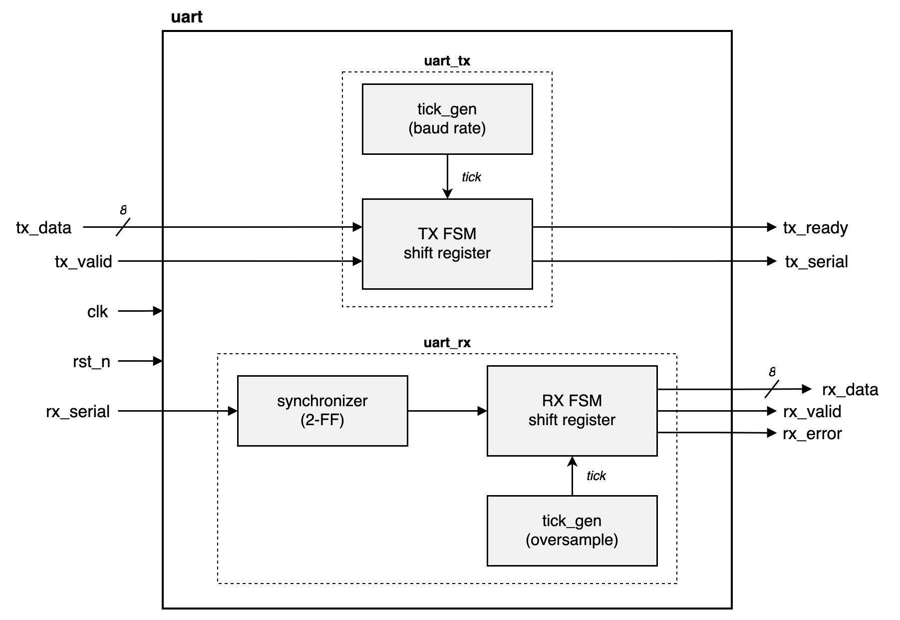

# uart

[](https://github.com/drewbabel/uart/actions/workflows/ci.yml)

A configurable 8N1 UART core in SystemVerilog, verified in loopback on a Basys 3, with:

- A transmitter that serializes a parallel byte behind start and stop bits through a `tx_ready` handshake.
- A receiver that oversamples the incoming line to recover each byte and flags framing errors.
- A tick generator dividing the system clock to the baud rate and the receiver oversample rate.
- A two-flop synchronizer guarding the asynchronous receive input against metastability.



## Verification

| Module | Method |
|--------|--------|
| `synchronizer` | Self-checking testbench |
| `tick_gen` | Self-checking testbench |
| `uart_tx` | Self-checking testbench + SymbiYosys proofs |
| `uart_rx` | Self-checking testbench + SymbiYosys proofs |
| `uart` | cocotb loopback + FPGA validation |

The formal proofs establish the transmit `tx_ready` handshake protocol, stable framing with idle-line enforcement, and receiver framing correctness under the oversampling assumptions.

## Implementation

Synthesized for the Xilinx Artix-7 XC7A35T through Yosys and nextpnr-xilinx.

| Module | LUTs | Flip-flops | Fmax |
|--------|------|------------|------|
| `synchronizer` | 0 | 2 | |
| `tick_gen` | 2 | 3 | |
| `uart_tx` | 25 | 26 | 316 MHz |
| `uart_rx` | 32 | 34 | 296 MHz |
| `uart` | 63 | 60 | |

`fmax.sh` places and routes each module in a registered-boundary harness. The frequencies come from nextpnr-xilinx, an experimental open-source flow with no vendor-signed timing analysis.

## Building and running

```
make MOD=uart_rx                    # run a module's testbench
make wave MOD=uart_rx               # run the testbench and open the waveform in Surfer
make formal MOD=uart_rx             # run the module's SymbiYosys proof
make trace MOD=uart_rx              # print a formal counterexample as text
make view-formal MOD=uart_rx        # open a formal waveform in Surfer
make cocotb                         # run the top-level cocotb loopback test
./synth_stats.sh uart               # report a module's synthesis cost
./fmax.sh uart_tx tt_uart_tx clk    # fmax and utilization
```

### Tool versions

Icarus Verilog 13.0, cocotb 2.0.1, Yosys 0.66, SymbiYosys 0.66 with Yices 2 and Z3, nextpnr-xilinx 0.8.2, and Surfer.
